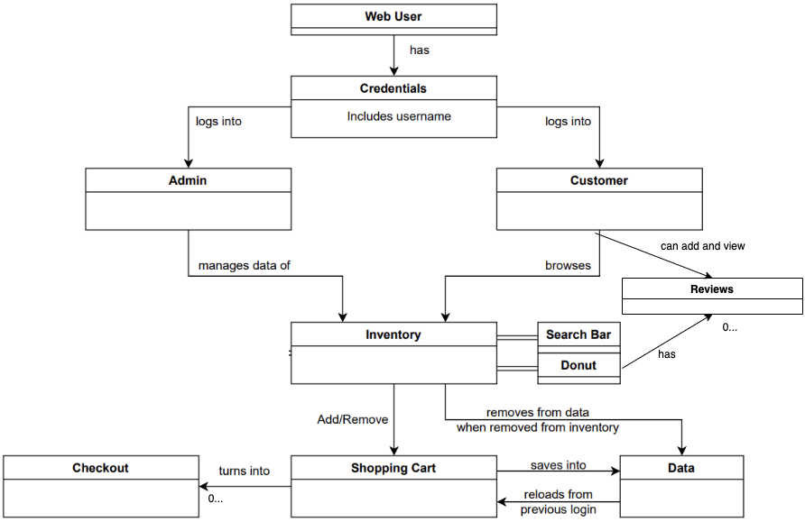
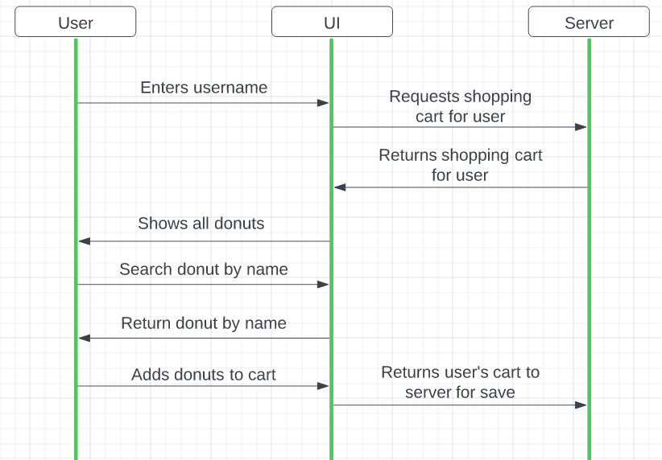
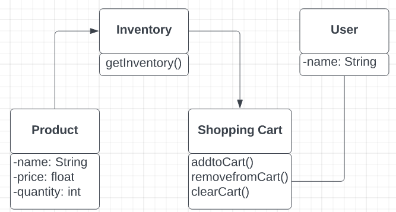
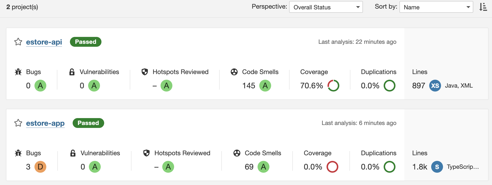
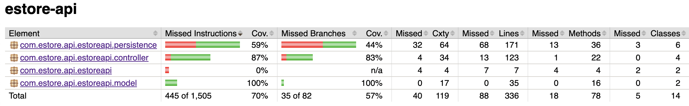

# PROJECT Design Documentation

## Team Information
* Team name: Joe's Os
* Team members
  * Joe Meyer
  * Bryan Lee
  * Nihar Patel
  * Jason Berry
  * Qadira Moore

## Executive Summary

Joe's Os is an e-store which sells different types of donuts to customers.

### Purpose
There are three main purposes of the project. The first is constructing a website that allows users to purchase, edit, and manage an e-store
with different user types. The second is to show how the individualized act of programming can be transformed into a large product maintained 
by a team of engineers. The third is to construct a minimum viable product with both the product owner's desires and the acts of programming.

### Glossary and Acronyms

| Term | Definition |
|------|------------|
| SPA | Single Page |
| MVP | Minimum Viable Product |

## Requirements

This section describes the features of the application.

Our application covers basic stories: A user can log in and add, remove, and delete donuts from a cart. A user can also view the total cost of their order and either clear the cart or checkout. A user can use a search bar to navigate the site faster. Additionally, a user can navigate the site using the navigation bar. 

Our application covers these epics: A user can log in, an admin can log in, a client can create a user, and a customer can browse the inventory. The customer can see the whole menu and an owner can manipulate the value of the products and their quantities.

### Definition of MVP
The product needs to allow a user to log in and log out and add products to the cart and check out. 
Additionally, the owner needs to be able to edit the inventory and view orders.

### MVP Features
Minimal Authentication for customer/e-store owner login & logout
    A simple username to log in is all that is minimally required. 
    Assume a user logging in as an admin is the e-store owner.
Customer functionality
    Customer can see a list of products
    Customer can search for a product
    Customer can add/remove an item to their shopping cart
    Customer can proceed to check out their items for purchase
Inventory Management
    E-Store owners can add, remove and edit the data on the inventory
Data Persistence
    Your system must save everything to files such that the next user will see a change in the inventory based on the previous user's actions. So if a customer had something in their shopping cart and logged out, they should see the same items in their cart when they log back in.
Your 10% feature
    We have implemented reviews on each product as our 10% feature.

### Roadmap of Enhancements
Update UI for the orders page.
Fix some OOD principles.

## Application Domain

This section describes the application domain.

The overall hierarchy of the domain model consists of a Web User that can either be an Admin or a Customer. These users are accessed by the credentials that consist of a username. Both users are able to browse the inventory on the web page using a search bar. The inventory contains different donuts, which can be individually added to a shopping cart. The shopping cart contains different quantities of donuts, a price, and the total of the cart. The shopping cart changes to an order if the customer wishes so, and all of this is stored persistently with data and json files.

## Architecture and Design

Our application uses various different languages and components to create our site. We have all of our cart and product data stored in json files. We used java to send the json data to our angular components via http requests. Those requests are read by our product, cart, login, and reviews services and are converted from their json into Product, Cart, User, and Reviews objects. The interfaces for those objects store the data from the json conversion. 

With those objects from the data, we can display the data to our client. Each product and cart have its own html pages and css styles to display the product details and the number of donuts inside the cart. 

Our most crucial feature login, asks the owner to enter a string and stores the string. If the string is the admin user then the admin gets access to new buttons which allow them to add, delete, update, and remove donuts. Our admin typescript verifies if you are an admin and uses the http requests to change the values of the donut via the product service. 

The dashboard is the parent class that shows a navigation bar of all the products, the login, and the cart. When logged in as admin a new button called admin will be created on the dashboard.

### Summary

The following Tiers/Layers model shows a high-level view of the webapp's architecture.

The e-store web application, is built using the Model–View–ViewModel (MVVM) architecture pattern. 

The Model stores the application data objects including any functionality to provide persistence. 

The View is the client-side SPA built with Angular utilizing HTML, CSS, and TypeScript. The ViewModel provides RESTful APIs to the client (View) as well as any logic required to manipulate the data objects from the Model.

Both the ViewModel and Model are built using Java and Spring Framework. Details of the components within these tiers are supplied below.

### Overview of User Interface

This section describes the web interface flow; this is how the user views and interacts
with the e-store application.

A user starts on the default view of the store on /dashboard but cannot start shopping until they log in. The user clicked on the login button, enters a username, and logs in. The client clicks on the all products and scrolls to see which donuts they like. A client clicks on a donut and clicks on add to cart. A client can hit back to get back to the /products. A client can enter a donut name in the search bar to find a donut as well.

When a client is done selecting, they can tap cart to view their donuts. To increase, decrease or remove a donut, the client clicks on the different buttons under the donuts name. A user can hit clear to remove all items in a cart. When a client adds or removes a donut, the total cost of the order will be displayed in the bottom of the page. 

### View Tier

In the view tier UI, the user can initially see all the available donuts in the store by browsing through the shop whether by scrolling with their mouse or typing in a search term in the search bar with keyboard input. The user is able to click on these donuts to see more details on it such as the price and add it to their shopping cart. The user clicks a button to add to their cart. The user is also able to view their cart by clicking on the cart button at the top. From there, the user can adjust the quantity of each donut they have added. However, the user can only add and remove donuts to their cart once they've logged in. They log in by clicking on the login button and entering their username with keyboard input.

### ViewModel Tier

The view model tier for our project essentially displays the data of each user's shopping cart that's reserved in the Model tier when needed. When a user logins and edits and views their shopping cart, the data must be saved even after logging out which is stored in the Model. The view model allows for this data to be shown to the UI. The same principle applies when the admin edits the inventory. The inventory is saved in the Model, but the model can edit that data from the UI by removing, adding, or editing donuts details. 

### Model Tier

The Model holds all the user's data, admin data, the shopping cart data for each user, and the current inventory. All login information per user is stored in the Model by username; this includes the admin. The donuts held in each shopping cart are also stored in the Model tier because the shopping cart must save all the donuts in it even after the user logs out; therefore, when the user logs back in he/she can return to their already existing shopping cart. Lastly, the inventory that has all the donut details including price, name, and quantity is held in a list in the Model tier.

### Static Code Analysis
Both analyses of the java backend and the typescript front end passed. The only problems seem to stem from the html where the sonicqube does not like our use of certain tags. For instance it preferred <"strong"> to <"b">. There were 69 code smells in the analysis for the angular code. Most of the smells are unused imports that were either left in from copy and pasting or old implementations of code that used them. The java api had 145 code smells due to it having more lines than the angular, but again most of these were due to unused imports. Neither of the code smells resulted in any vulnerabilities and still resulted in an A rating. As seen in the picture, both analyses resulted in good ratings with the exception of the bugs in the estore-app which again are not harmful once taken a closer look at.

### Recommendations for Improvements
Based off the static code analysis, we could make some simple changes like deleting unused imports and changing html tags to improve our code although these are mostly irrelevant. Most other improvements would be in the unit testing. Our angular is 0% tested and our api is a little more than 70%. We do not use a model for two of our rest api's which would be fixed if we had more time. Due to the lack of a model, some of the unit testing could not be completed. Other than that the only thing we would fix if we had more time was UI design. Some pages do not look as great as they could but they function and that is really what matters.

### Design Principles Analysis
Within our Angular code we do not follow the Law of Demeter as well as we can. We have some files, particularly the service classes, that get used all over because it was the easiest although not the best implementation. However, in our backend, we follow the Law of Demeter very well because the api files only talk to their friends. Our service files also do not follow the Single Responsibility rule perfectly because they do a lot although they mostly just interact with the api backend. Once again, the backend follows single responsibility well. Our backend has files that are simple but we did not oversimplify. Finally, both our front end and backend implement Low Coupling well. Our Angular and api files do not have unnecessary couplings with other files. 

## Testing
We performed two types of testing, Unit Testing for the backend and Acceptance Testing to confirm the
user's experience matches the MVP. The unit testing involved making Java files in our API folder that tested 
the API code. The acceptance testing used the angular service to make sure all of the goals we set for 
the sprint were completed.

### Acceptance Testing
All of our user stories for this sprint passed their acceptance criteria tests. Using the requirements from the owner, we developed multiple acceptance tests for each user story that made sure they all functioned properly and they all passed without any concerns.

### Unit Testing and Code Coverage
For most classes, we try to achieve 70% at least, there are some notable
anomalies, however, as testing CartFileDao proved really challenging, and some
other tests were equally difficult to write. So long as everything is functional for
the user, and there are no bugs in the program, code coverage doesn't need to be 100%.
